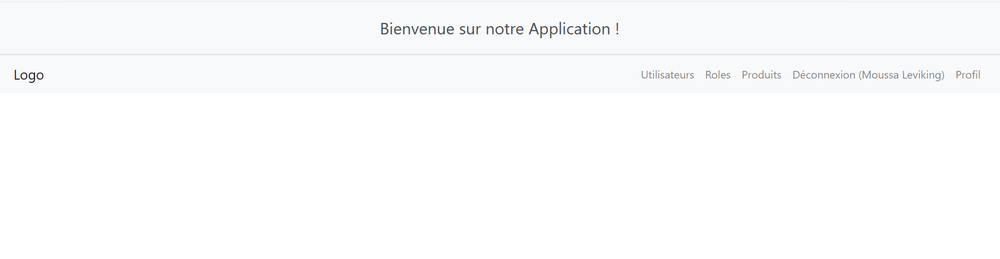
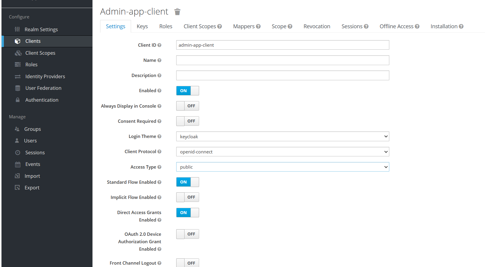
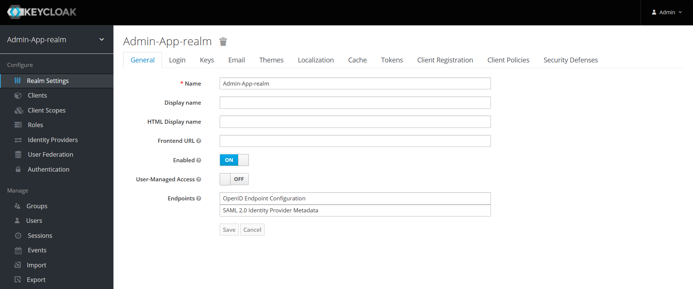
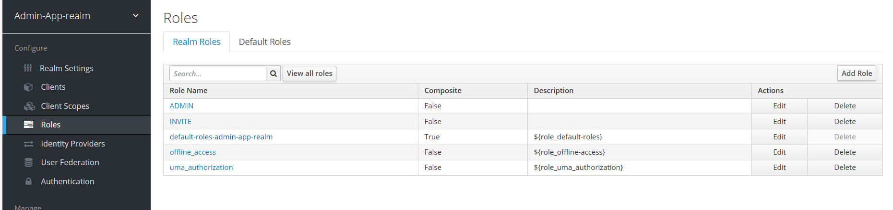
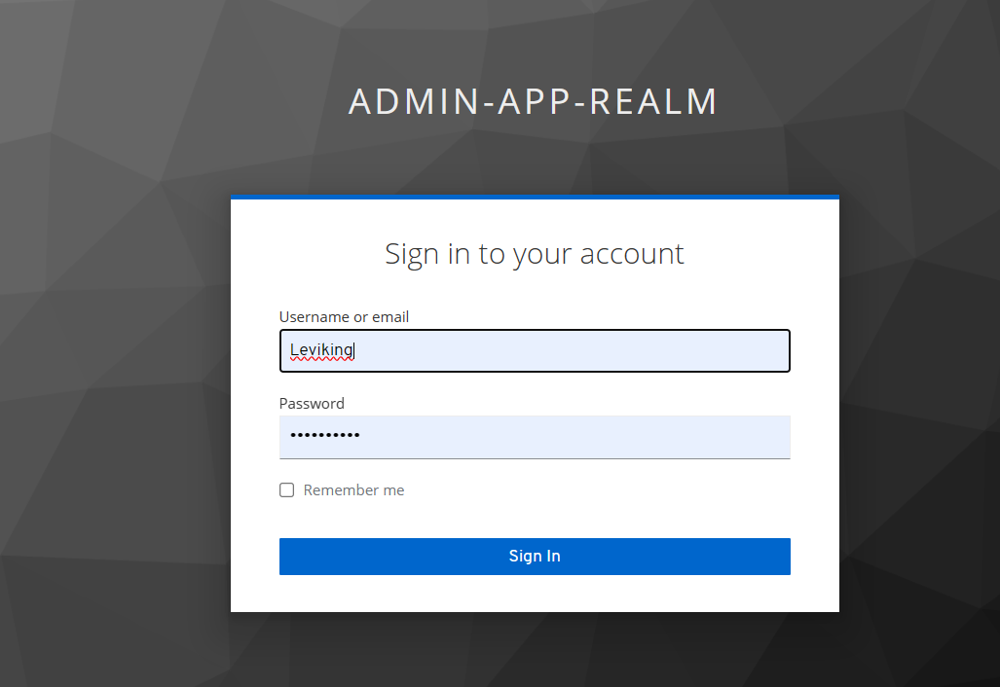
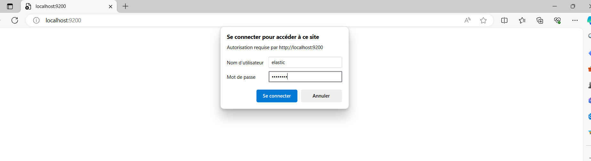
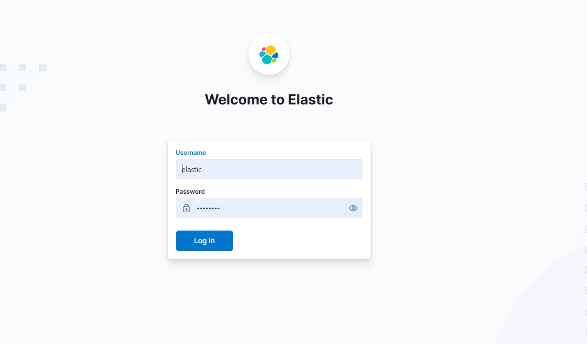
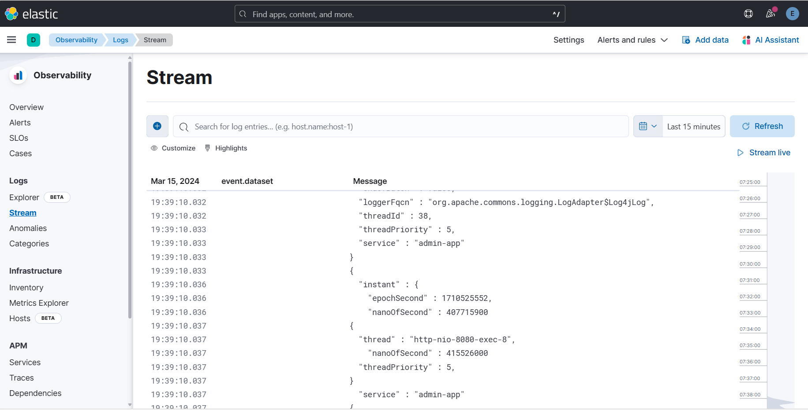
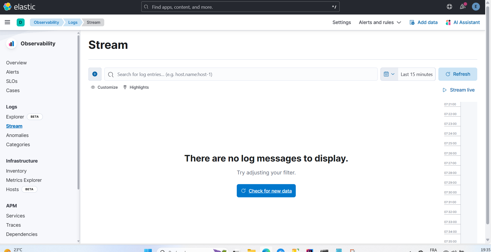

# Guide de Configuration et d'Utilisation de l'Application

Ce guide fournit les instructions pour configurer une application avec Keycloak pour l'authentification et l'autorisation, ainsi que pour l'utilisation de la pile Elastic (ELK) pour la journalisation et la surveillance.

## Configuration de l'Application avec Keycloak

### Accueil de l'Application

Vue de l'écran d'accueil de l'application avec des options pour naviguer entre différentes sections.

### Ajout d'un Client dans Keycloak

Étapes pour ajouter un client dans le realm Keycloak, avec les configurations nécessaires.

### Création d'un Nouveau Realm

Processus de création d'un nouveau realm dans Keycloak.

### Ajout de Rôles

Comment ajouter des rôles dans Keycloak qui peuvent être attribués aux utilisateurs.

### Ajout d'un Utilisateur dans Keycloak

Ajout d'utilisateurs dans Keycloak et attribution de rôles.

### Écran de Connexion

Écran de connexion pour Keycloak où les utilisateurs saisiront leurs identifiants.

## Utilisation du Stack ELK

### Connexion à Elasticsearch

Connexion à l'instance Elasticsearch pour la gestion des données.

### Connexion à Kibana

Écran de connexion à Kibana pour la visualisation des données et la création de dashboards.

### Visualisation des Logs

Surveillance des logs en temps réel dans Kibana.

### Examen des Logs dans Kibana

Exploration et filtrage des logs dans Kibana pour une analyse détaillée.

---

Assurez-vous de bien suivre toutes les instructions et de configurer les permissions correctement dans Keycloak et votre application. Les logs doivent être configurés pour être collectés et indexés par la pile ELK pour permettre leur surveillance et analyse dans Kibana.
